<picture>
  <source media="(prefers-color-scheme: dark)" srcset="assets/banner-dark.svg">
  
</picture>

### Hi, I'm Andreas.

I trained in **Product Design Engineering at Loughborough**, and now I build with AI: hardware, software and brand, from brief to working thing, fast.

- 🔨 **Now:** leading web and brand at **Hardest Adventures**
- 🎯 **Looking for:** early roles at AI startups where design and building meet
- 🏆 **2025:** Loughborough Enterprise Network Student of the Year, for my surf wearable venture **MANTA**

## Things I've built

| | Project | What it does |
|:-:|---|---|
| ⌚ | **NeuroCompass** | ESP32-S3 wrist rig that turns a medication dose change into a measured feedback loop. Hardware, firmware, analysis. |
| 🗂️ | **Personal OS** | One blank page a day. A nightly cloud agent turns it into metrics, a wiki and a morning email. Six Obsidian plugins on top. |
| 👓 | **AI-engineered eyewear** | Pipeline that sizes glasses frames to your face, plus aesthetics research and CAD. |
| 👁️ | **Pupil tracker** | Measures pupil dilation from a normal laptop webcam. OpenCV + MediaPipe. |
| 🎬 | **Reel engine** | Photos and a song in, beat-synced vertical videos out. Code-first in Remotion. |
| 🗣️ | **Speakeasy** | Highlight any text, hit a shortcut, hear it read aloud. Groq TTS. |
| 🎹 | **Pro Tools (tiny)** | A browser DAW that records audio and MIDI from my Nord Stage 3. |
| 🤖 | **Agent Hub** | A 3D model viewer built by four AI agents working together. |
| ⛽ | **Find My Fuel** | Live map of UK fuel prices across ~7,000 stations, from the 14 official CMA feeds. [Try it →](https://petrol-prices-seven.vercel.app) |
| 📊 | **Claude status line** | Context window and plan-limit meters for Claude Code, in one dependency-free file. Open source. [Code →](https://github.com/andreas-purse/claude-statusline) |

Most of my code lives in private repos for now. Happy to walk you through any of it.

## Toolbox

           

## Find me

 
